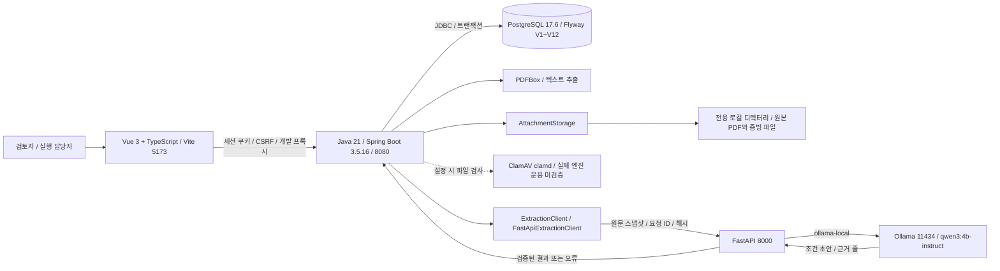

# 현재 구성과 데이터 흐름

기준: 2026-09-17, Flyway V12. 로컬 개발 구성으로, 운영 배포도나 회사가 승인한 보안 경계는 아니다.

Gradle Wrapper 8.7, Python 3.12·uv를 사용한다. 브라우저는 PostgreSQL·FastAPI·Ollama에 직접 접근하지 않는다. FastAPI 기본 provider는 disabled이며 로컬 실행 도구에서 활성화한다. fixture는 합성 계약 검증 전용이다. [로컬 실행·한도](local-ai.md)

## 책임과 저장

| 영역 | 책임 | 보존 위치 |
| --- | --- | --- |
| Vue | 입력·대조·검토·다운로드·이탈 방지 | 서버 조회, 작성 중 입력은 메모리; 자동 복구 없음 |
| Spring | 인증·권한·CSV 검증·PDF 추출·승인·조건 판정·수량 계산·업무 상태 | PostgreSQL·전용 파일 저장소 |
| PostgreSQL | 버전별 데이터·원문·조건·판정·계정·업무·다운로드 요청 이력 | compose 로컬 볼륨, 백업은 별도 |
| FastAPI / Ollama | 제한된 원문에서 조건 초안 생성·검증, 수동 검토로 거절 | 결과와 모델·프롬프트 메타데이터는 Spring이 DB에 저장 |
| PDF 원본·증빙 | 불변 바이트 보관·인증 다운로드·해시 확인 | Git 밖 전용 로컬 디렉터리 |
| CSV | 구조화 행과 원본 해시·크기 등 메타데이터 | DB; 원본 CSV 바이트 영구 보관·재다운로드 없음 |

## 원문·데이터·판정의 버전

PDF 미리보기는 임시 처리다. 사건 등록 시 파일을 다시 검사·추출하고 미리보기 해시와 대조해 원본·서버 추출본·검토 원문 v1을 함께 저장한다. 이후 원문 수정은 source_revision을 추가하고 사건의 현재 원문 버전을 갱신한다. 과거 버전의 AI 결과는 유지하되 새 조건 전환을 차단한다.

입고 증거 승인에 따른 데이터 보완은 새로운 dataset과 assessment_run을 만든다. 상품 연결은 조건 정의 JSONB, 개별 판정은 결과 JSONB에 저장한다. 과거 판정·승인은 원문 수정만으로 바뀌지 않는다. 조건·판정의 원문 재검토 표시 개선은 [미구현 제안](product-roadmap.md)이다.

원문 버전(source_version), 조건 버전, 데이터 ID, 판정 ID, 작업 버전, 사건 종료·재개 버전은 서로 다른 개념이다. 번호가 같다고 동일 시점·근거로 묶지 않는다. 상세 구조는 [실제 ERD](erd.md)를 따른다.

## 권한·통신·운영 경계

단일 기업이며 두 역할은 업무 자료를 조회한다. 검토자는 승인·배정·원문 수정·종료·계정 관리를 수행하고, 실행 담당자는 증거 제안과 본인 작업 실행·증빙 제출을 수행한다. 세션 공유 저장소·다중 기업 격리는 없다.

사용자가 선택한 실행 경로는 Spring → 로컬 FastAPI → 로컬 Ollama다. 외부 모델 자동 대체나 문서 URL 추적은 하지 않는다. 의존성·모델 설치 다운로드는 별도다. 임의 실행 설정·OS 방화벽·타 프로세스·백업까지 통제하는 것은 아니며, clamd 사용 시 지정 검사 서버로 파일 바이트가 전송된다. [AI 데이터 경계](ai-data-boundary.md)

파일 저장 실패·DB 롤백 시 원본 파일도 정리한다. 강제 종료의 고아 파일 점검은 증빙과 원본 PDF 참조를 함께 확인한다. DB와 파일을 함께 복구해야 한다. 운영 저장소·보관·복구·검사 엔진은 [파일 관리 기준](file-data-policy.md)을 따른다. Vite 프록시는 개발 전용이며 운영 정적 파일 제공·HTTPS·API 라우팅은 미구현·배포 보류다.
