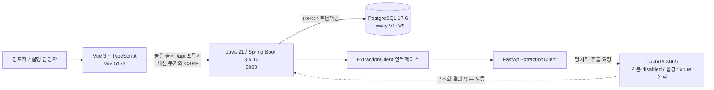

# 현재 구성과 데이터 흐름

기준: 2026-09-13, develop 20095d7. 로컬 개발 구성이다. 운영 배포도나 회사가 승인한 보안 경계가 아니다.

Gradle Wrapper 8.7을 사용한다. Vite 프록시는 개발 구성이고 배포 시 정적 파일 제공과 API 라우팅은 별도 구성해야 한다. 브라우저는 PostgreSQL·FastAPI에 직접 접근하지 않는다. PostgreSQL은 compose의 로컬 볼륨에 데이터를 저장한다. 이 볼륨이 백업을 대신하지 않는다.

## 책임과 보존 위치

| 영역 | 책임 | 현재 보존 위치 |
| --- | --- | --- |
| Vue | 업무 입력·검색·비교·다운로드, 역할별 화면 | 서버 데이터 조회; 비밀번호·세션 토큰을 localStorage에 보관하지 않음 |
| Spring | 인증·CSRF·권한, CSV 검증, 조건 판정, 증거 검토·작업·종료, API | 업무 기록은 PostgreSQL |
| PostgreSQL | 버전별 입력, 승인 정의·판정 JSONB, 증거·작업·계정 변경 이력 | 로컬 postgres_data 볼륨 |
| FastAPI | 조건 추출 계약과 합성 응답; 실제 모델은 미연결 | 처리 결과·오류는 Spring이 DB에 보존 |
| CSV 업로드 | 파싱·검증 후 구조화 데이터와 파일 메타데이터 저장 | 원본 바이트의 영구 저장·재다운로드 없음 |
| CSV 내보내기 | 특정 저장 판정의 재고·출고 결과 파일화 | 사용자가 다운로드한 기기 |

## 버전과 권한

데이터 보완은 원본 갱신 대신 새로운 dataset 및 assessment_run을 만든다. 상품 연결은 조건 정의 JSONB 안에, 개별 판정은 결과 JSONB 안에 저장한다. 대상 판정과 작업 상태는 분리한다.

단일 기업이며 두 역할은 기업 업무 데이터를 조회한다. 검토자만 승인·작업 배정·종료·계정 관리·검토 대기함을 사용할 수 있다. 실행 담당자는 입고 증거를 제안하고 본인 배정 작업을 시작·증빙 제출한다. 계정 보안 버전은 요청마다 검사한다. 세션 공유 저장소·다중 기업 격리는 없다.

## 외부 통신과 향후 파일 저장

FastAPI 주소는 설정 가능하므로 코드만으로 사내망을 강제하지 않는다. 실제 모델·OCR·임베딩 서비스는 연결하지 않았다. 외부 전송 차단·텔레메트리·백업 경계는 운영 설계에서 검증해야 한다. [AI 데이터 경계](ai-data-boundary.md)

다음 파일 첨부는 Spring의 저장 인터페이스 뒤에 로컬 어댑터를 먼저 두는 기술안을 제안한다. 공개 정적 경로를 만들지 않고 로그인·업무 권한을 검사한 다운로드만 제공한다. 실제 저장소·보관 정책은 [파일 관리 초안](file-data-policy.md)에 구분했다. 현재 시스템에 파일 저장소가 이미 있다는 뜻은 아니다.
