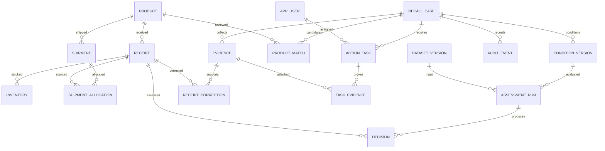

# 논리 ERD 초안

상태: 전체 업무 모델은 설계 초안. DB는 PostgreSQL로 확정했으며 입력 데이터 6개 테이블(dataset, product, receipt, inventory, shipment, shipment_allocation)은 V1 마이그레이션으로 구현했다.
단일 기업 MVP 기준이다. 다중 기업 지원 시 모든 조회·유일키·참조에 기업 경계를 추가해야 한다.

| 엔터티 | 주요 항목·제약 |
| --- | --- |
| PRODUCT | id, 상품명, 제조사, 규격, 수량 단위 |
| RECEIPT | id, product_id, 제조번호 nullable, 소비기한 nullable, 입고량, 입고일, 데이터 버전 |
| INVENTORY | id, receipt_id, 창고, 현재 수량, 보류 상태, 기준 시각 |
| SHIPMENT | id, order_id, product_id, 출고량, 출고일 |
| SHIPMENT_ALLOCATION | id, shipment_id, receipt_id, 연결 수량. 한 출고에 여러 입고 제조분 연결 가능 |
| RECALL_CASE | id, 제목, 출처, 원문 문서, 담당자, 업무 상태 |
| CONDITION_VERSION | id, case_id, 버전, 조건 트리, 원문 근거, 초안/승인/대체 상태, 승인자·시각 |
| PRODUCT_MATCH | id, case_id, product_id, 후보/승인/거절 상태, 비교 근거, 검토자·시각 |
| DATASET_VERSION | id, 원본 파일 해시·위치, 기준 시각, 검증 상태. 가져온 행은 버전에 귀속 |
| ASSESSMENT_RUN | id, condition_version_id, dataset_version_id, 사용한 연결·보완 버전, 실행 상태·시각 |
| DECISION | id, run_id, receipt_id, TARGET/NON_TARGET/NEEDS_REVIEW, 이유 코드, 근거. 실행+입고 유일 |
| EVIDENCE | id, case_id, 파일 위치·해시, 문서 유형, 검토 상태 |
| RECEIPT_CORRECTION | id, evidence_id, receipt_id, 변경 필드·전후 값, 승인자·시각. 원본 보존 |
| ACTION_TASK | id, case_id, 대상 참조, 유형, 담당자, 상태, 완료 시각. 대상 판정과 독립 |
| TASK_EVIDENCE | task_id, evidence_id. 복합 유일키 |
| APP_USER | id, 사용자 식별자, REVIEWER/OPERATOR 역할 |
| AUDIT_EVENT | id, case_id, 행위자, 행위, 대상, 전후 값, 시각. 추가 전용 |

## 무결성과 판정 규칙

- 수량은 0 이상이고 연결 수량은 양수다. 단위가 같아야 합산한다. 샘플은 정수 EA만 지원한다.
- 출고별 연결량 합계는 출고량 이하여야 한다. 부족분은 추적 미확정이며 비대상에 합산하지 않는다.
- 연결된 입고와 출고의 product_id가 같아야 한다. DB 제약과 트랜잭션 검증으로 보호할 항목이다.
- 제조번호는 단독 식별키가 아니다. 입고 건과 상품을 함께 보며 누락 제조번호의 입고도 고유 ID로 유지한다.
- 데이터 오류는 업로드 검증 오류로 처리하고, 정상 등록된 데이터의 판정 정보 누락과 구분한다.
- 미승인 상품 후보는 비대상으로 단정하지 않는다. 샘플의 P1 연결 승인과 P2/P3 거절은 사람이 사전 검토한 정답이다.
- 조건은 제한된 AND/OR 트리로 저장한다. 누락은 UNKNOWN으로 평가하고 FALSE AND UNKNOWN은 FALSE, TRUE OR UNKNOWN은 TRUE다. 남은 UNKNOWN만 확인 필요다.
- 재판정은 새 실행을 생성한다. 이전 결과를 갱신하지 않으며 조건·데이터·상품 연결·승인된 보완의 정확한 버전을 기록한다.
- 추가 증거 승인은 특정 입고 사실만 보완한다. 없는 출고 연결을 생성하지 않는다.
- AI 분석 실행에는 요청 ID, 입력 해시, 모델·프롬프트 버전, 응답, 오류, 처리 시간을 기록한다. 상세 분석 테이블은 AI API 계약과 함께 설계한다.

## 다음 구현 범위

CSV 검증·등록과 입력 스키마에 이어 사건·조건 버전·승인·판정 실행·영향 조회를 구현했다. V2는 recall_case, recall_condition, assessment_run을 추가하며 개별 판정은 assessment_run.result JSONB에 보존한다. 논리 모델의 상품 검토는 조건 정의에 포함한다. V3의 receipt_evidence는 입고 텍스트·제안값·검토 이력·기준/결과 판정을 보존한다. 보완 승인은 전체 데이터 스냅샷 복제와 재판정으로 구현했으며 별도 RECEIPT_CORRECTION 테이블은 아직 없다. V4의 response_task, response_task_proof, response_task_event로 수동 대응 작업·배정·증빙·검토·완료/재개 이력을 구현했다. V5에서 사건 OPEN/CLOSED 상태와 case_lifecycle_event로 종료 점검·승인·재개 이력을 구현했다. V6의 app_user로 로그인 계정과 REVIEWER/OPERATOR 역할을 구현했다. 신규 승인·작업 이력은 로그인 username을 사용하며 과거 라벨은 보존한다.
