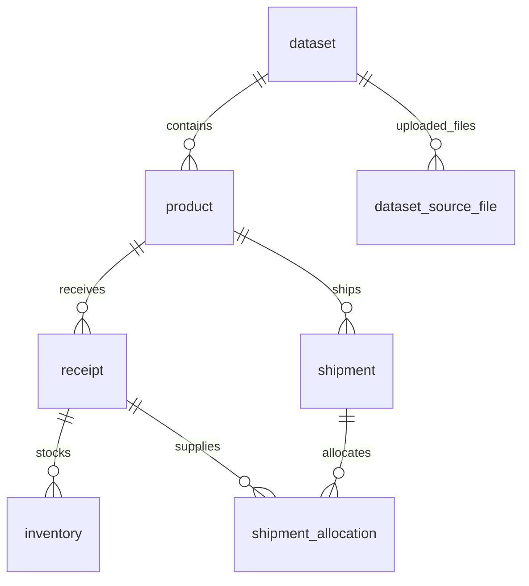
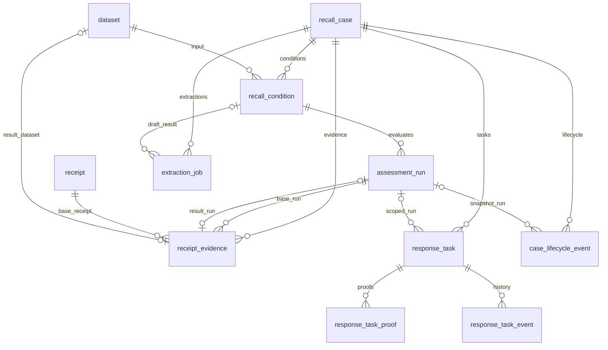
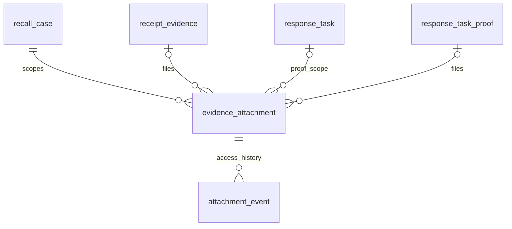

# 구현 ERD와 데이터 사전

기준: 2026-09-14, 첨부 검사 V11 반영. [Flyway V1~V11](../../backend/src/main/resources/db/migration/)의 실제 20개 테이블을 기준으로 한다. 단일 기업 모델이며 아래 선은 DB FK 관계다. 복합 FK의 정확한 컬럼은 데이터 사전·SQL을 따른다.

## 입력 데이터

product, receipt, inventory, shipment, shipment_allocation의 PK는 `(dataset_id,id)`다. dataset에서 하위 행으로 이어지는 버전 범위를 참조하며 같은 id라도 다른 버전의 행과 구분한다.

| 테이블 | 키와 주요 컬럼 | DB 제약·의미 |
| --- | --- | --- |
| dataset | id UUID PK; as_of, created_at, uploaded_by nullable | 업로드 또는 증거 보완 스냅샷. uploaded_by는 과거 식별자를 보존하는 TEXT, 사용자 FK 아님 |
| dataset_source_file | (dataset_id,file_type) PK; filename nullable, sha256, byte_size, row_count | dataset FK; 유형 5종 제한; SHA-256 형식·크기·행수 비음수. 파일 바이트 자체는 없음 |
| product | 복합 PK; name, manufacturer, pack_size, unit | dataset FK; unit=EA |
| receipt | 복합 PK; product_id, lot_number/expiry_date nullable, received_quantity, received_at | (dataset_id,product_id) FK; 입고량 ≥0; 상품을 포함한 복합 유일키 |
| inventory | 복합 PK; receipt_id, warehouse, quantity, hold_status | 입고 복합 FK; quantity ≥0; NONE/HELD |
| shipment | 복합 PK; order_id, product_id, quantity, shipped_at | 상품 복합 FK; quantity ≥0; 상품을 포함한 복합 유일키 |
| shipment_allocation | 복합 PK; shipment_id, receipt_id, product_id, quantity | 출고·입고 각각 (dataset_id,id,product_id) FK로 상품 일치 보장; quantity >0 |

입고량 대비 재고+연결 출고 합계, 출고량 대비 연결 합계, 기준일과 입출고 날짜 검사는 CSV 서비스가 수행한다. 합계 제한이 단일 행 DB CHECK로 구현됐다고 해석하지 않는다.

## 사건·판정·증거·작업

| 테이블 | 주요 구조 | 제약·상태 |
| --- | --- | --- |
| recall_case | id UUID PK; title, source_type, source_text, created_at, status, lifecycle_version, closed_at | 출처 SUPPLIER/OFFICIAL/INTERNAL; OPEN/CLOSED와 closed_at 일관성 |
| recall_condition | id PK; case_id FK, dataset_id FK, version, definition JSONB, status, approved_by/at | (case_id,version) 유일; DRAFT/APPROVED와 승인 정보 일관성 |
| assessment_run | id PK; case_id, condition_id, dataset_id, result JSONB, created_at | (condition_id,case_id,dataset_id)로 조건 FK; id+사건 및 id+사건+데이터 복합 유일키 |
| receipt_evidence | id PK; case_id; base_assessment_id/base_dataset_id/receipt_id; document_text/hash; proposal JSONB; status; 검토자·사유·시각; result_dataset_id/result_assessment_id | 사건·기준 판정·기준 입고 FK; 결과 판정의 사건/데이터 일치; 결과 데이터·판정 각각 유일; PENDING/APPROVED/REJECTED |
| response_task | id PK; case_id; assessment_id nullable; task_type, target_type/target_id, title, instructions, assignee; status, version, review_round, completed_at | 사건 FK; 판정+사건 복합 FK; CASE는 target_id 없음, INVENTORY/SHIPMENT는 target_id·판정 필수; OPEN/IN_PROGRESS/COMPLETED/CANCELLED |
| response_task_proof | id PK; task_id FK; review_round; evidence_text/hash; submitted_by/at; status; reviewed_by/note/at | 회차 >0; PENDING/ACCEPTED/REJECTED와 검토 정보 일관성 |
| response_task_event | id PK; task_id FK; version, event_type, actor, details JSONB, created_at | (task_id,version) 유일 |
| case_lifecycle_event | id PK; case_id FK; version, event_type, assessment_id nullable, reviewer, note, snapshot JSONB, created_at | (case_id,version) 유일; CLOSED/REOPENED; CLOSED는 판정 필수; 판정+사건 FK |
| extraction_job | id PK; case_id FK; requested_by; source_text/hash; status, review_status; response JSONB/raw_response; error_code, duration_ms, 시각; reviewed_by/note/at; condition_id nullable FK | QUEUED/RUNNING/SUCCEEDED/FAILED; PENDING/ACCEPTED/DISMISSED; 진행 작업 사건별 하나인 부분 유일 인덱스 |

현재 상품 연결 검토는 `recall_condition.definition` 안에 productReviews·원문 인용·조건 트리로 보존한다. 개별 입고 판정 및 재고·출고 영향은 `assessment_run.result` 안에 저장한다. PRODUCT_MATCH·DECISION·RECEIPT_CORRECTION이라는 별도 테이블은 없다. 모델·프롬프트 정보는 추출 응답 계약 내 값이며 별도 모델 테이블은 없다.

증거 승인 시 새 dataset을 복제·보완하고 새 조건/판정을 만든다. 부모 데이터 컬럼을 dataset에 중복 저장하지 않고 승인 증거의 base/result 관계로 출처를 조회한다. 원본 CSV 해시를 보완 데이터의 직접 업로드 파일로 복사하지 않는다.

## 계정과 감사

| 테이블 | 키와 주요 컬럼 | 의미 |
| --- | --- | --- |
| app_user | username VARCHAR(64) PK; display_name, password_hash, role, enabled, created_at, security_version | REVIEWER/OPERATOR; BCrypt 저장; 보안 변경 시 버전 증가 |
| account_security_event | id UUID PK; username, actor, event_type, note, created_at | PASSWORD_CHANGED/DISABLED/ENABLED; username·actor는 FK가 아님 |

assignee, 승인자·등록자·이력 actor 등 사용자 문자열에는 DB 사용자 FK를 두지 않는다. 신규 HTTP 요청은 로그인 계정에서 행위자를 결정하고 작업 배정은 활성 계정을 서비스에서 검증한다. 과거 식별자와 라벨은 보존한다. `response_task.target_id`도 실제 재고/출고 테이블 FK가 아니라 지정 판정 결과 안에서 서비스가 확인한다.

## 변경 원칙과 한계

대상 판정·상품 연결·조치 상태는 독립이다. 승인 조건과 판정 결과는 애플리케이션 경로에서 덮어쓰지 않으며 증거 보완은 새 버전을 만든다. DB 관리자까지 차단하는 WORM 저장소나 전 테이블 수정 방지 트리거가 있다는 의미는 아니다. 세션 테이블·범용 감사 로그 테이블·기업 tenant 테이블은 현재 없다.

새 기능에서 스키마를 바꾸면 마이그레이션과 이 문서를 같은 작업에서 갱신한다. 파일 관련 테이블과 관계는 아래 V10 항목을 따른다.

## V10 파일 첨부

| 테이블 | 키와 주요 컬럼 | DB 제약·의미 |
| --- | --- | --- |
| evidence_attachment | id UUID PK; case_id, evidence_id/task_id/proof_id; filename, media_type, byte_size, sha256, uploaded_by, created_at | 입고 증거 또는 작업 증빙 하나에만 연결; 증거+사건·작업+사건·증빙+작업 복합 FK; 파일은 전용 디렉터리에 저장 |
| attachment_event | id UUID PK; attachment_id FK; event_type, actor, created_at | UPLOADED/DOWNLOAD_REQUESTED; 사용자 문자열은 FK 아님 |

증거에 (id,case_id), 작업 증빙에 (id,task_id) 유일키를 추가해 첨부의 사건·작업 경계를 DB에서도 검증한다. 원본 바이트는 DB 외부에 있으며 커밋 완료와 파일 무결성을 애플리케이션이 확인한다. 별도 첨부 삭제·교체 API는 없다.

## V11 첨부 검사 메타데이터

evidence_attachment에 scan_status(NOT_SCANNED/CLEAN), scan_engine, scanned_at을 추가한다. CLEAN은 업로드 당시 엔진과 검사 시각이 있어야 하며, 과거 파일은 NOT_SCANNED로 이관한다. 새 테이블은 없다. 다운로드는 설정된 현재 엔진으로 다시 검사하며 업로드 메타데이터를 덮어쓰지 않는다.
